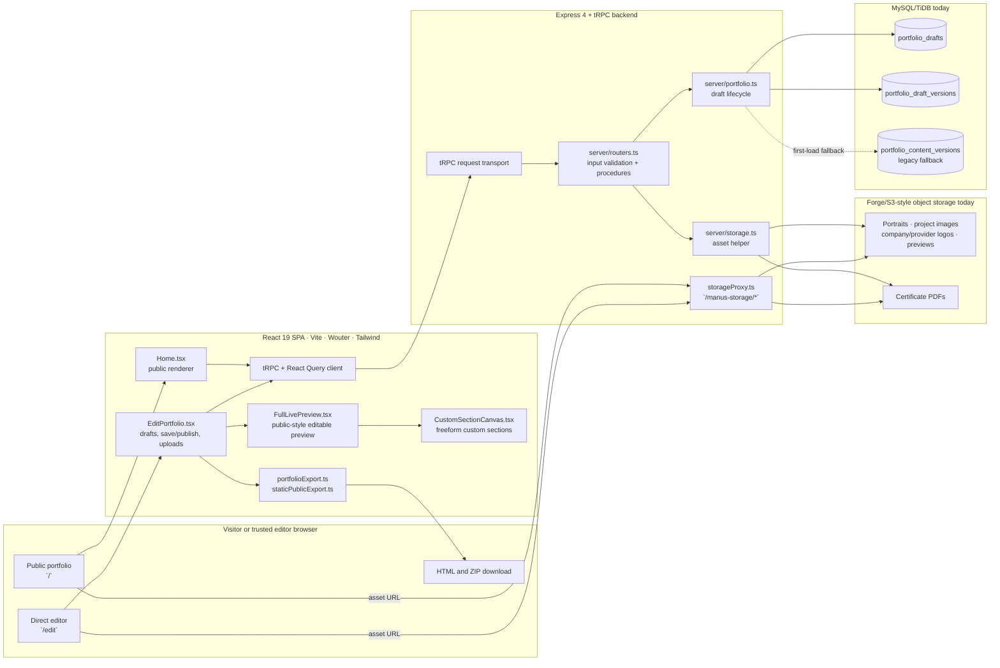
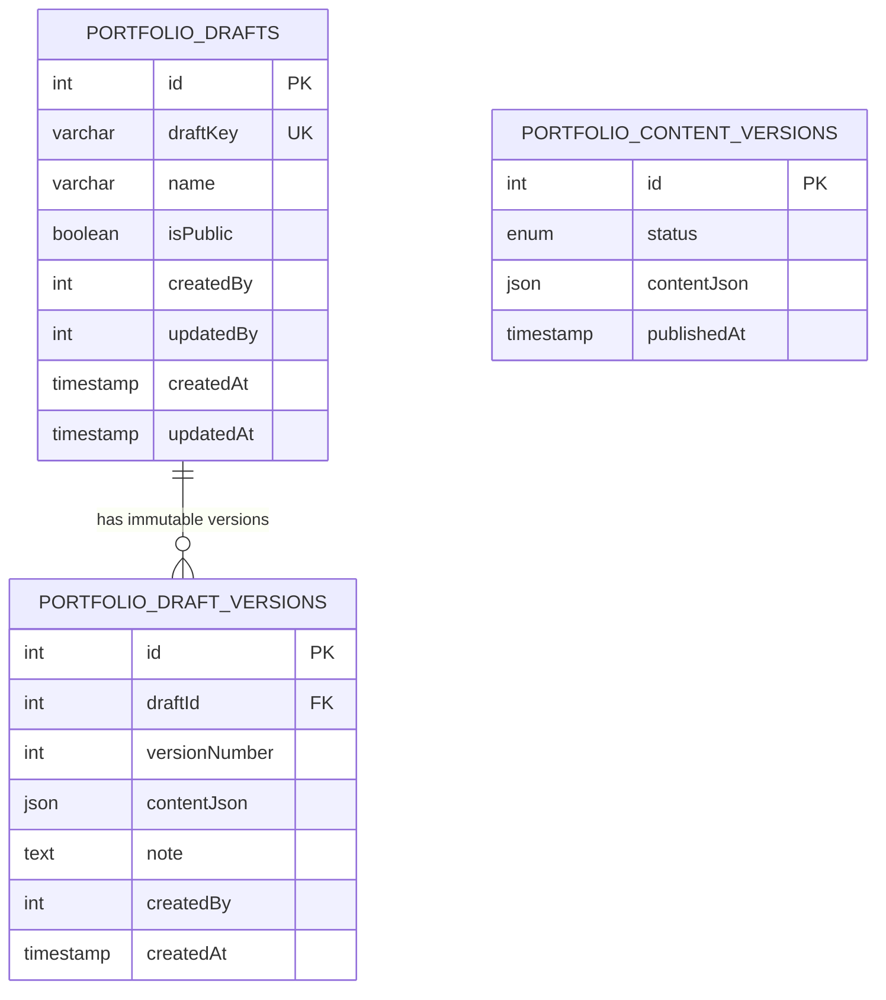
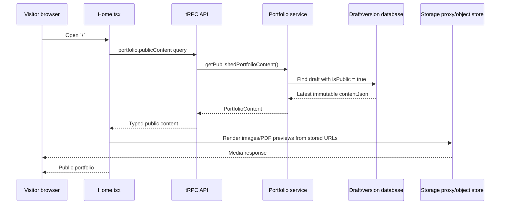
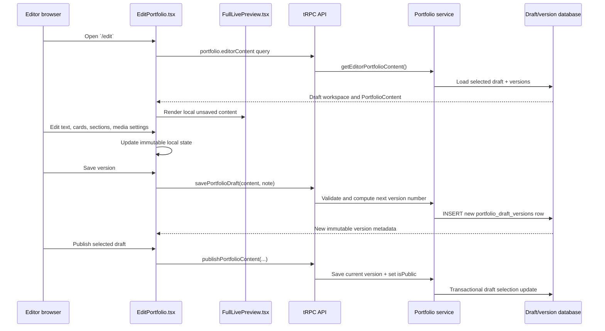
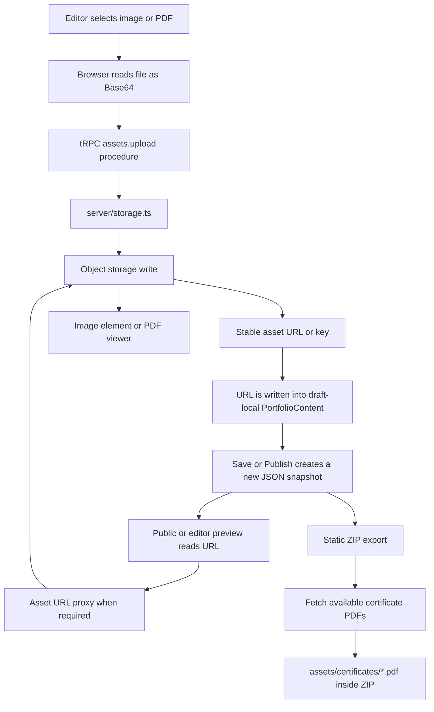
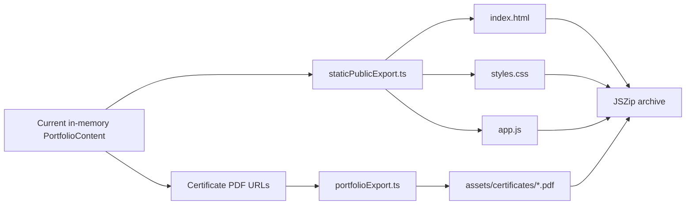
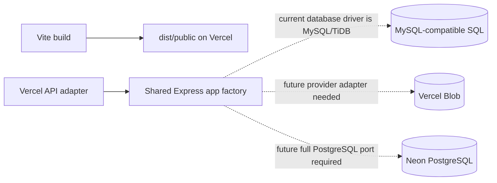

# Comprehensive Architecture Diagram

This document is the standalone architecture reference for the portfolio. It explains how the public site, `/edit` workspace, API, database, asset/PDF storage, exports, and paused deployment boundary work together.

> **Current deployment boundary:** local/managed development works with MySQL/TiDB plus Forge/S3-style storage. Vercel work is paused. Do not assume Neon PostgreSQL or Vercel Blob has been configured, migrated, or tested.

## 1. Runtime architecture

## 2. Database relationship diagram

The application stores editable portfolio content as immutable JSON snapshots. This is intentional: one snapshot can capture the whole public portfolio, section order, hidden sections, images, canvas layouts, and exportable content as one coherent version.

| Record | Purpose | Important invariant |
|---|---|---|
| `portfolio_drafts` | Stores a named workspace such as Main portfolio or a future alternative draft. | One draft is selected as public at a time. |
| `portfolio_draft_versions` | Stores the full `PortfolioContent` document for each saved version. | Existing versions are immutable; a restore inserts another version instead of changing history. |
| `portfolio_content_versions` | Stores the legacy pre-multi-draft stream. | It is a bootstrap/fallback source, not the preferred target for new features. |

## 3. Public read flow

The public site is data-driven. It does not have separate hard-coded public text for every editable item. The selected public draft determines the content rendered by `Home.tsx`.

## 4. Editor save, publish, and restore flow

| Editor action | Database result | What it does **not** do |
|---|---|---|
| Change a field locally | Nothing until Save or Publish. | It does not alter public content immediately. |
| Save version | Inserts the next immutable snapshot. | It does not automatically make the draft public. |
| Publish | Saves the current snapshot, then selects the draft as public. | It does not delete other drafts or versions. |
| Restore | Uses old content to create a new current version. | It does not overwrite newer history. |

## 5. Asset and certificate PDF lifecycle

| Asset kind | Stored where | Database/snapshot stores | Public consumer |
|---|---|---|---|
| Portrait, project image, custom canvas image | Object storage | URL in `PortfolioContent` | `` in public/editor render. |
| Company/provider logo | Object storage or provider text configuration | URL/value in `PortfolioContent` | Experience/certification cards. |
| Certificate preview | Object storage | Preview URL | Certificate-card image. |
| Certificate PDF | Object storage | PDF URL | In-page viewer and static ZIP package. |

The relational database stores **references**, not file bytes. This keeps version records compact and lets the static export package download accessible PDFs separately.

## 6. Export boundary

The export utilities receive the current browser draft state. They can generate a simple standalone HTML file or a faithful ZIP package with `index.html`, `styles.css`, `app.js`, image assets where available, and certificate PDFs stored locally under `assets/certificates/`.

Exporting does not automatically save or publish the current draft. An editor must save/publish separately if the exported state should become durable or public.

## 7. Paused Vercel target boundary

The `vercel.json` file already defines the static output, SPA fallback, and current `/manus-storage/*` rewrite. It does **not** make the database or uploads production-ready by itself. Vercel work remains paused.

## 8. Source ownership map

| Concern | Authoritative files |
|---|---|
| Public presentation | `client/src/pages/Home.tsx`, `client/src/index.css` |
| Editor workspace | `client/src/pages/EditPortfolio.tsx`, `client/src/pages/FullLivePreview.tsx`, `client/src/pages/edit-extensions.css` |
| Shared content contract | `shared/portfolio.ts` |
| Immutable editor transforms | `client/src/lib/editorContent.ts` |
| Canvas behavior | `client/src/components/CustomSectionCanvas.tsx` |
| Project crop controls | `client/src/components/ProjectImageControlPanel.tsx` |
| API validation | `server/routers.ts` |
| Draft lifecycle | `server/portfolio.ts` |
| Database schema | `drizzle/schema.ts`, `drizzle.config.ts`, `server/db.ts` |
| Asset storage/proxy | `server/storage.ts`, `server/_core/storageProxy.ts` |
| Export | `client/src/lib/portfolioExport.ts`, `client/src/lib/staticPublicExport.ts` |
| Vercel routing | `vercel.json`, `api/[...path].ts`, `server/_core/app.ts` |

## 9. Change-impact rule

When a request adds an editable content field, treat it as a cross-layer change: update the shared contract/defaults, public render, live preview, editor controls/state helpers, server validation if needed, static export, and regression tests. Update this diagram whenever the relationship between these layers changes.
