# Branch and Release Workflow

This record is the mandatory source for any agent or developer deciding where to make a change and when it may be tested on Vercel.

> **Stable policy:** `main` is the stable development branch. `deployment_versel` is the Vercel-connected **Production Branch** by explicit user-approved configuration on 2026-08-22. Develop and validate on `main`; obtain explicit release approval before moving a checkpointed candidate to `deployment_versel`, because that push creates a Production Deployment.

## Branch roles and current state

| Branch | Role | Current operating rule |
|---|---|---|
| `main` | Stable development source of truth | New portfolio features, application behavior, migrations, tests, documentation, and AI-context changes begin here after a task is logged in `todo.md`. It may mirror Vercel guidance, but a mirror is not a deployed implementation. |
| `deployment_versel` | Vercel-connected Production Branch | Holds the production-ready candidate, Vercel routing, generated API bridge, and service-specific artifacts. A new push creates a Production Deployment; never force-push or use it for unreviewed experimentation. |
| Production deployment | User-facing release target | Is created from `deployment_versel`. Every new push to that branch requires explicit release approval and post-deploy verification. Changing the branch tracking again or assigning a Production domain requires a direct user request. |
| Local Docker Compose | Optional development convenience | Runs isolated local PostgreSQL and the app from `main`; it is never a Production deployment path and never receives Vercel credentials. |

## One working branch rule

Agents and developers must treat this as one codebase with a one-way release path. Implement a feature once on `main`, test and checkpoint it there, then move the reviewed candidate to `deployment_versel` only after explicit user approval. Do not reproduce a feature manually in both branches or make ordinary development edits directly on `deployment_versel`.

The local Compose workflow is documented in [`../docs/local-docker-development.md`](../docs/local-docker-development.md). It provides an isolated PostgreSQL database for persistent `/edit` testing but must never contain Vercel, Neon, Blob, or Production credentials.

## Mandatory agent flow

```mermaid
flowchart LR
  Request[User feature or fix request] --> Todo[Add unchecked task to todo]
  Todo --> Context[Read relevant AI context and documentation]
  Context --> Main[Implement and validate on main]
  Main --> Checkpoint[Checkpoint reviewed stable work]
  Checkpoint --> Approval[explicit production approval]
  Approval --> Candidate[Move intended commits to deployment versel]
  Candidate --> Production[Vercel Production deploys candidate]
  Production --> Evidence[Verify routes data uploads logs]
  Evidence --> Record[Update AI context and changelog]
  Record -. user approval required .-> Production[Production action]
```

## Feature impact rules

| Change | Required companion work | Deployment consequence |
|---|---|---|
| Public UI or content-editing UI | Keep `Home.tsx` and `FullLivePreview.tsx` aligned; test responsive parity. | Preview both `/` and `/edit`. |
| Shared portfolio field | Update `shared/portfolio.ts`, default data, editor, public renderer, export, persistence, and tests. | Save/reload a disposable private draft on Preview. |
| Database schema | Add provider-neutral Drizzle schema change, reviewed migration, query/API code, and PostgreSQL tests. | Apply only through approved schema workflow; record database evidence. |
| Server/API source | Regenerate `api/[...path].js` with `pnpm build:vercel-api`. | Verify `/api/trpc/auth.me` returns JSON before treating `/edit` as working. |
| Image/PDF upload | Use Blob for bytes and PostgreSQL metadata; keep originals outside the repository. | Upload a safe file privately and verify Blob object, metadata, and rendering. |
| Vercel config/service | Update the handbook and relevant decision/risk records. | Never change Production settings automatically; `deployment_versel` pushes now require release approval. |

## Required validation gate

Run `pnpm check`, `pnpm test`, and `pnpm build` before checkpointing substantive code changes. If server/API behavior changes, run `pnpm build:vercel-api` first. A schema change additionally needs migration review and safe host application; a Vercel handoff additionally needs Preview route and data verification.

## Current Vercel facts and limits

| Topic | Verified current fact | Agent constraint |
|---|---|---|
| Production Branch | Vercel Production Environment now tracks `deployment_versel`, as explicitly approved by the user. | Never push unreviewed work there; each push creates a Production Deployment. |
| API route | `vercel.json` routes `/api/*` to generated CommonJS `api/[...path].js`. | Regenerate the artifact after server/API source changes. |
| Documentation mirror | `main` carries Vercel and API-bridge documentation for stable development planning. | Do not infer that `main` itself is the branch Vercel executes; implementation and Preview evidence remain on `deployment_versel`. |
| Database | Application code uses provider-neutral PostgreSQL; Neon is the current Vercel-connected host. | Never disclose `DATABASE_URL`; do not couple code to Neon-only APIs. |
| New media | Vercel Blob stores bytes; `portfolio_media_assets` stores metadata. | Do not store bytes in PostgreSQL. |
| Legacy media | Seven seeded `/manus-storage` references still need separate migration. | Do not claim historic media is Blob-migrated or modify Main for smoke tests. |
| Editor | `/edit` is intentionally unauthenticated. | Treat any public deployment as security-sensitive. |

## Reading order for an agent planning release work

1. Read this file and `current-work.md`.
2. Read [`../docs/development-branch-workflow.md`](../docs/development-branch-workflow.md).
3. Read the [Vercel Deployment Handbook](../docs/vercel-deployment/README.md), especially its release runbook and service guide.
4. Read [`vercel-api-bridge.md`](./vercel-api-bridge.md) before changing API routes, serverless code, or generated function artifacts.
5. Read `database-and-data.md`, `issues.md`, and `preview-verification-evidence.md` if the task changes persistence or media.
6. Add exact work items to `todo.md`, then implement on `main`.

## Documentation maintenance rule

When branch policy, Vercel services, environment-variable responsibilities, routes, database strategy, or asset delivery changes, update this file, `current-work.md`, `decisions.md`, `issues.md`, the Vercel handbook, and the relevant implementation documentation in the same checkpoint.
