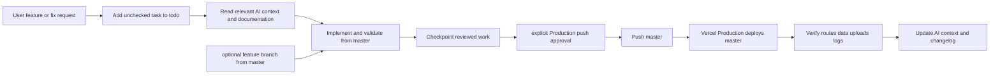

# Master-First Branch and Release Workflow

This is the mandatory branch policy for agents and developers deciding where to make a change and when it may become live on Vercel.

> **Active policy, user-approved 2026-08-24:** `master` is the sole canonical application branch and Vercel **Production Branch**. Every approved push to `master` creates a Production deployment. `deployment_versel` remains unchanged at `e448599` as a historical release and rollback reference; it is no longer an active feature or release branch.

## Branch roles and current state

| Branch or environment | Role | Operating rule |
|---|---|---|
| `master` | Canonical development source and Production Branch | Begin every task here. Build, test, document, checkpoint, and push only after explicit approval. |
| `feature/*` (optional) | Short-lived isolated review work | Create only from current `master`; reconcile back to master before release. |
| `deployment_versel` | Historical Production release | Preserve unchanged as rollback evidence; never use for ordinary new work. |
| Vercel Production | Live portfolio | Current verified source: `master` commit `732c0ac`, Ready in 31 seconds on 2026-08-24. |

## Mandatory agent flow

## Operational rules

1. Start with `git switch master` and `git pull --ff-only origin master`.
2. Add new requested work to `todo.md` before implementation.
3. Keep public `Home.tsx` and `FullLivePreview.tsx` aligned for editable public sections.
4. Run `pnpm check`, `pnpm test`, and `pnpm build`; run `pnpm build:vercel-api` whenever server/API behavior changes.
5. Use a disposable private draft for PostgreSQL, persistence, or Blob upload checks. Do not use the selected public Main draft as test data.
6. Update `docs/`, `current-work.md`, `decisions.md`, `issues.md`, and `change-log.md` when a durable branch, service, API, database, or deployment fact changes.
7. Ask for explicit approval immediately before `git push origin master`, because it creates a live Production deployment.
8. Preserve `deployment_versel` and never force-push, reset hard, use unrelated-history merges, or delete a branch without explicit direction.

## Vercel facts and constraints

| Topic | Verified current fact | Agent constraint |
|---|---|---|
| Production Branch | Vercel Production Environment Branch Tracking is `master`. | Treat master push as live deployment action. |
| Latest Production | Deployment ID `GuUXgkhsehPTuVKxDDm3ij8UycEU` is Ready from `master` commit `732c0ac`. | Verify `/`, `/edit`, and relevant API behavior after future releases. |
| Previous Production | `deployment_versel` commit `e448599` is retained unchanged. | Use only with new explicit rollback direction. |
| API route | `vercel.json` routes `/api/*` to generated CommonJS `api/[...path].js`. | Regenerate after server/API source changes. |
| Database | Provider-neutral PostgreSQL; Neon is the currently connected host. | Do not disclose `DATABASE_URL` or couple code to Neon-only APIs. |
| Media | Vercel Blob stores new bytes; PostgreSQL stores metadata. | Do not store file bytes in PostgreSQL. |
| Legacy media | Historical `/manus-storage` migration remains paused. | Do not modify Main, Draft 2, or legacy objects without explicit request. |
| Editor | `/edit` is intentionally unauthenticated. | Treat every Production release as security-sensitive. |

## Reading order for a future feature

1. Read this record and `current-work.md`.
2. Read [`../docs/development-branch-workflow.md`](../docs/development-branch-workflow.md) and [`../docs/release-and-media-operations.md`](../docs/release-and-media-operations.md).
3. Read the [Vercel Deployment Handbook](../docs/vercel-deployment/README.md) before configuration or deployment work.
4. Read [`vercel-api-bridge.md`](./vercel-api-bridge.md) before changing API routes, serverless code, or generated function artifacts.
5. Read `database-and-data.md`, `issues.md`, and `preview-verification-evidence.md` if persistence or media is affected.
