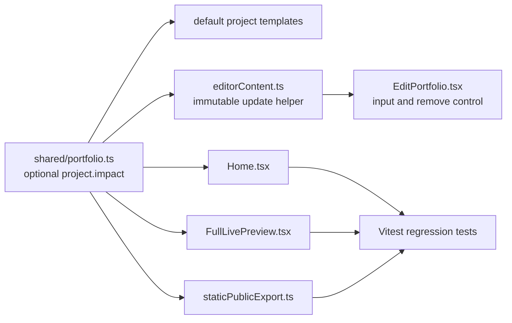

# Worked AI Agent Workflow: Processing a New Feature Request

This example shows how a future AI agent should process a realistic feature request without guessing facts, corrupting drafts, or changing only one layer of the application.

## Example request

> “In Selected Work, add an optional **Impact** field that I can edit for each project and show publicly below Realization.”

An Impact field may contain a factual outcome, such as a measured improvement or documented delivery result. The agent must not invent metrics, client names, or claims. If the user has not provided a real Impact statement, the field can remain optional and empty.

## Phase 1: Read the correct context

| Agent action | Files / evidence | Expected output |
|---|---|---|
| Read operating rules | `ai-context/README.md`, `AI_AGENT_SYSTEM_PROMPT.md` | Knows that changes require todo, tests, documentation, and checkpoint evidence. |
| Read active status | `current-work.md`, `issues.md`, `decisions.md` | Confirms Vercel is paused and editor is intentionally direct-access. |
| Read feature architecture | `technical-architecture.md`, `database-and-data.md`, `design-system.md` | Identifies that projects are part of the shared `PortfolioContent` JSON model, not a separate SQL table. |
| Read source ownership | `shared/portfolio.ts`, `Home.tsx`, `FullLivePreview.tsx`, `EditPortfolio.tsx`, `editorContent.ts`, export utilities, related tests | Builds a concrete affected-file list before editing. |

The agent should summarize its understanding in one sentence before changing code:

> “Impact is an optional project-content field, so it needs a shared type/default, editable live-preview control, public render, export render, and regression coverage; it does not require a database schema migration because projects are stored inside versioned JSON.”

## Phase 2: Clarify facts and plan

The agent asks only questions that affect correctness. In this example, it may ask whether Impact should be a single short sentence or a labeled set of numeric/text outcomes, and whether existing projects should start blank or receive user-supplied verified statements.

It then adds explicit checklist items before implementation:

```markdown
## Selected Work Impact Field

- [ ] Add optional Impact data to the shared project contract and defaults.
- [ ] Render Impact in public Selected Work and live editor preview only when present.
- [ ] Add direct editor controls for adding, editing, and removing Impact text.
- [ ] Add export support and regression tests for empty and populated Impact behavior.
- [ ] Verify desktop/mobile layout, type checking, tests, build, and documentation updates.
```

It also adds a concise active-work record:

```markdown
| 1 | In progress | Add optional verified Impact text to Selected Work. | Preserve blank state; do not fabricate project outcomes. |
```

## Phase 3: Make the smallest coherent implementation



The agent follows this sequence:

1. Extend the shared project type and default template with an optional `impact?: string` field.
2. Add a pure immutable helper for editing/removing the field rather than mutating nested draft state directly.
3. Add editor controls in the Selected Work editing experience.
4. Render a labeled Impact block only when non-empty in both `Home.tsx` and `FullLivePreview.tsx`.
5. Update the static ZIP renderer so the exported portfolio remains faithful.
6. Add tests for the empty state, populated state, public/editor parity, and export content.

## Phase 4: Validate without damaging public data

| Validation step | Why it is necessary |
|---|---|
| Use an isolated test draft. | Prevents test text from appearing in Main portfolio. |
| Add one verified sample string only if supplied by the user. | Avoids fabricating a portfolio claim. |
| Check desktop and mobile preview. | Impact text can affect project-card height and alternating media alignment. |
| Run `pnpm check`. | Confirms shared type changes are handled in all consumers. |
| Run `pnpm test`. | Protects draft, UI, and export regressions. |
| Run `pnpm build`. | Ensures production bundle still compiles. |
| Verify save, publish, and restore on an isolated draft. | Confirms the field survives version history without corrupting previous snapshots. |

## Phase 5: Update durable memory and checkpoint

Before checkpointing, the agent updates:

| Record | Required update |
|---|---|
| `todo.md` | Mark only verified work complete. |
| `ai-context/current-work.md` | Record validation result and next state. |
| `ai-context/change-log.md` | Note the user-visible feature, contract impact, and validation. |
| `ai-context/design-system.md` | Update only if Impact introduces a reusable visual pattern. |
| `docs/components.md` or `docs/editor-workflow.md` | Update if the editor/public workflow changes materially. |

The checkpoint message should state the behavior and evidence, for example:

> “Added an optional, editor-managed Selected Work Impact block to shared project content, public/editor render paths, and static export. Blank fields remain hidden. Verified with an isolated draft, type checking, test suite, mobile/desktop review, and production build.”

## Stop conditions

The agent must stop and ask for guidance rather than guessing when any of these conditions occur:

| Condition | Correct response |
|---|---|
| User asks for numerical outcomes but has not supplied factual data. | Provide an editable blank/template; request real information. |
| The request requires modifying historical versions. | Propose an additive migration or transformation plan; do not mutate history in place. |
| The change reveals public/editor layout drift. | Fix parity before calling the feature complete. |
| Tests need a real external service/credential. | Keep the test deterministic where possible and request the minimum required configuration. |
| The task touches Vercel/database provider configuration. | Recognize the paused state and wait for explicit deployment resumption. |

This same pattern applies to images, certifications, writing, custom canvas blocks, draft features, and other portfolio enhancements: **read context, plan, change all affected layers, validate, document evidence, checkpoint.**
