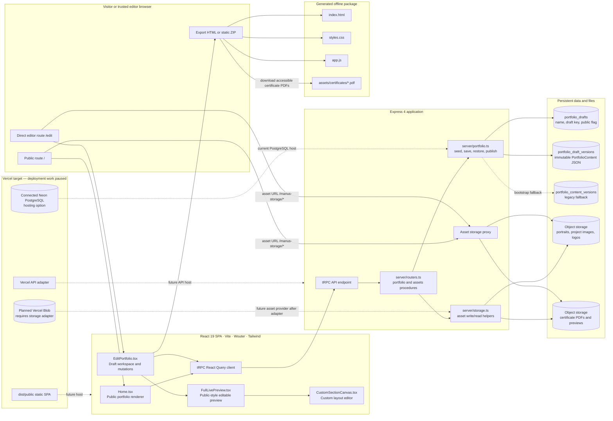
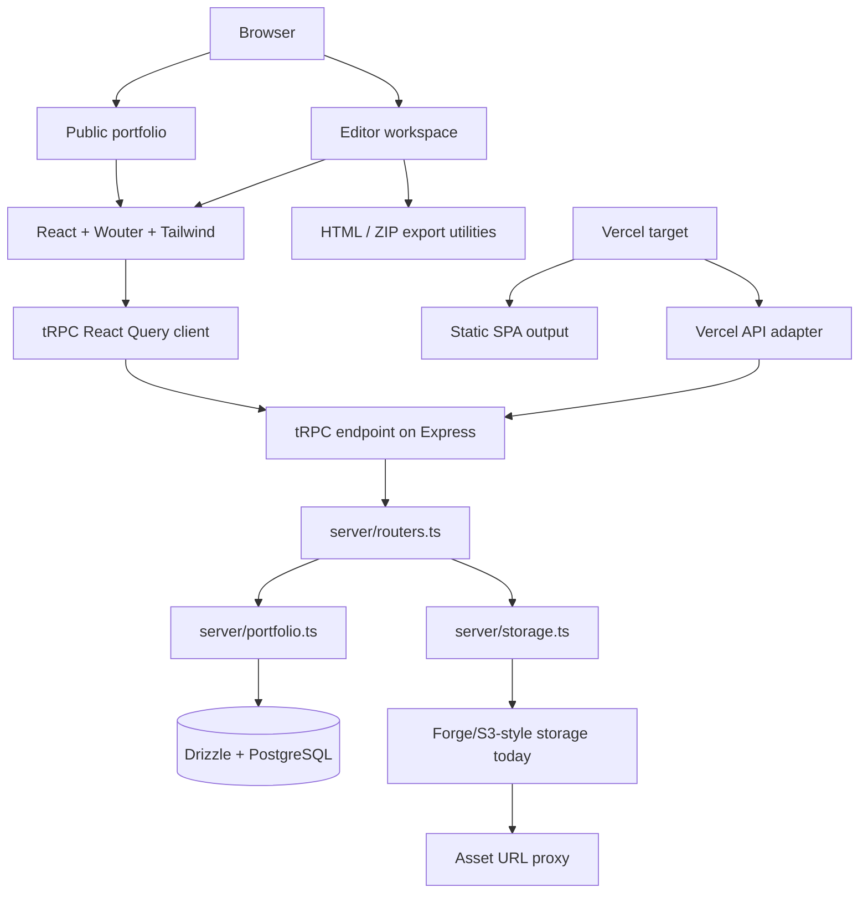

# Technical Architecture and Source Map

## Architecture in one paragraph

The portfolio is a React 19 single-page application with a public route and a direct editor route. Both consume a typed tRPC API served from Express. The server reads and writes JSON snapshots of `PortfolioContent` using Drizzle ORM. Images and PDFs are stored outside the database and referenced by URL. Vite builds the client, while a shared Express app factory supports local development and a Vercel serverless API adapter.

## End-to-end application and data diagram

This is the detailed relationship map for future agents. It covers the public/editor frontend, typed backend, draft database, object storage, certificate PDFs, static export, and the currently paused Vercel target.

### Relationship explanation

| Relationship | What happens | Important constraint |
|---|---|---|
| Public browser → `Home.tsx` | `/` queries the newest version of the selected public draft and renders it. | Public content is a draft snapshot, not hard-coded page copy. |
| Editor browser → `EditPortfolio.tsx` | `/edit` loads a complete draft workspace, then holds unsaved changes in local browser state. | Browser edits are not durable until Save version or Publish succeeds. |
| Editor → `FullLivePreview.tsx` | The editor displays public-style sections with scoped editing controls. | Layout changes must preserve parity with `Home.tsx`. |
| Client → tRPC / Express | React Query calls typed tRPC procedures at `/api/trpc`. | Do not introduce untyped internal fetch paths without a clear reason. |
| Portfolio service → draft tables | The service seeds, saves, restores, renames, deletes, publishes, and reads JSON snapshots. | Versions are immutable; restore writes a new version rather than overwriting one. |
| Asset service → object storage | Images, logos, previews, and certificate PDFs are uploaded separately and their URLs are embedded in content JSON. | No binary asset data belongs in database tables. |
| Storage proxy → browser | Current `/manus-storage/*` URLs are rewritten/proxied so stored URLs can be rendered. | A Vercel Blob migration must preserve historical asset access or migrate URLs deliberately. |
| Export → ZIP files | Export consumes the current editor draft, builds static public files, and packages accessible certificate PDFs locally. | Export does not automatically save a database version. |
| Vercel target | Vite static build and serverless adapter are present, but storage is not production-compatible yet. | PostgreSQL is provider-neutral; Neon is the connected host, while Blob still needs an adapter. |

## Stack inventory

| Layer | Current technology | Key rule |
|---|---|---|
| Client | React 19, Wouter, Tailwind CSS 4, shadcn/ui primitives, Lucide, Sonner | Use existing public components and CSS patterns before introducing a parallel UI system. |
| Data client | tRPC 11, TanStack React Query, SuperJSON | Use typed `trpc.*` hooks; do not add ad-hoc Axios/fetch clients for internal API procedures. |
| API | Express 4, tRPC 11, Zod | Procedures are mounted at `/api/trpc`. |
| Domain layer | TypeScript portfolio service | Protect data invariants and keep editor lifecycle logic server-side. |
| Database | Drizzle ORM with `pg` and `pg-core` | Use standard PostgreSQL APIs; Neon is a configured host, not a source-code dependency. |
| File storage | Vercel Blob for new uploads plus a legacy Manus-storage compatibility proxy | Store URLs in JSON content, Blob bytes outside PostgreSQL, and asset metadata in `portfolio_media_assets`. |
| Export | JSZip plus static render utilities | HTML/ZIP outputs must track public display behavior. |
| Build | Vite and esbuild | Run `pnpm build`; Vite produces `dist/public`. |
| Tests | Vitest | Treat existing editor/export regressions as required safety net. |

## Source map

| Concern | Primary files | Agent instruction |
|---|---|---|
| Routes, providers, app shell | `client/src/App.tsx`, `client/src/main.tsx` | Register routes and shared providers here; keep `/edit` direct unless user changes access model. |
| Public portfolio | `client/src/pages/Home.tsx` | Main public renderer. Any visible content addition likely belongs here. |
| Editor workspace | `client/src/pages/EditPortfolio.tsx`, `edit-extensions.css` | Owns draft local state, tRPC mutations, sidebar, save/publish, uploads, and text tools. |
| Editable public preview | `client/src/pages/FullLivePreview.tsx` | Public-style editor rendering. Maintain parity with `Home.tsx`. |
| Shared content contract | `shared/portfolio.ts` | Add fields here before touching editor/public persistence. |
| Pure editor transforms | `client/src/lib/editorContent.ts` | Add immutable helpers for collection edits, order, visibility, and custom sections. |
| Draft persistence | `server/portfolio.ts` | Enforces seed, save, restore, rename/delete, public selection, and public content loading. |
| API definitions | `server/routers.ts` | Keep input validation and client/server contract typed. |
| Database connection | `server/db.ts`, `drizzle/schema.ts`, `drizzle.config.ts` | Keep dialect, schema, migrations, and driver aligned. |
| Local / serverless app | `server/_core/index.ts`, `server/_core/app.ts`, `server/vercel-api-handler.ts`, generated `api/[...path].js`, `vercel.json` | Reuse `createPortfolioApp()` and regenerate the CommonJS artifact after server/API changes. |
| Storage | `server/assets.ts`, `server/_core/storageProxy.ts`, `portfolio_media_assets` | New editor uploads use Vercel Blob plus PostgreSQL metadata; the proxy is only a legacy compatibility path. |
| Custom canvas | `client/src/components/CustomSectionCanvas.tsx` | Preserve group behavior, snap grid, alignment guides, preset persistence, and mobile fallback. |
| Project image controls | `client/src/components/ProjectImageControlPanel.tsx` | Keep crop zoom/focal point/ratio/frame preferences persistent and safe. |
| Static export | `client/src/lib/portfolioExport.ts`, `client/src/lib/staticPublicExport.ts` | Update when public content fields or interactions change. |
| Tests | `server/*.test.ts`, `client/src/**/*.test.ts(x)` | Add regression tests near the behavior that changes. |

## Request flow

### Public portfolio flow

1. `Home.tsx` queries `portfolio.publicContent`.
2. The router calls `getPublishedPortfolioContent()`.
3. The service finds the draft where `isPublic = true`, loads its newest version, and returns its typed `contentJson`.
4. The public page applies section order/visibility and renders the result.

### Editor flow

1. `EditPortfolio.tsx` requests `portfolio.editorContent` for the active or public draft.
2. The server seeds `Main portfolio` only if no multi-draft records exist.
3. The editor copies returned content into browser state and changes it through immutable helper functions.
4. Save creates a new immutable snapshot. Publish saves and then marks the selected draft public.
5. Query invalidation reloads the editor/public content as needed.

### Upload flow

1. The editor reads a chosen file as Base64.
2. `assets.upload` receives a category, file name, MIME type, and payload.
3. The server validates the file, writes bytes to Vercel Blob, and inserts a PostgreSQL metadata record.
4. The returned URL is written to local draft state.
5. Save or Publish stores that reference within a `contentJson` snapshot.

### Export flow

1. The editor provides its current in-memory `PortfolioContent` to the export control.
2. The export utility generates either a lightweight standalone HTML or a faithful static ZIP.
3. The ZIP includes `index.html`, `styles.css`, `app.js`, available local assets, and certificate PDFs under `assets/certificates/` when accessible.

## Change impact matrix

| Proposed change | Must inspect / modify |
|---|---|
| Add content field | `shared/portfolio.ts`, defaults, `Home.tsx`, `FullLivePreview.tsx`, `EditPortfolio.tsx`, export render, tests. |
| Add a mutable list item | Shared contract, `editorContent.ts` helper, editor handlers, public render, controls/guards, export, tests. |
| Add upload type | Router validation, storage category, editor handler, content field, public render, export behavior, test. |
| Change public layout | `index.css`, `Home.tsx`, `FullLivePreview.tsx`, mobile behavior, accessibility/focus states. |
| Change API behavior | Router inputs, domain service, client mutation/query, tests, error UI. |
| Change database provider | `server/db.ts`, Drizzle schema/config, dependencies, migration process, connection env docs, test strategy. |
| Change static export | `portfolioExport.ts`, `staticPublicExport.ts`, export tests, offline asset packaging. |

## Serverless adapter facts

Local development uses the Express app from `server/_core/index.ts`. Vercel uses the generated CommonJS `api/[...path].js` artifact built from `server/vercel-api-handler.ts`, which imports the shared `createPortfolioApp()` factory. The Vercel configuration routes `/api/*` to that function before filesystem and SPA fallbacks, preserves the legacy Manus-storage route, and sends other client routes such as `/edit` to `index.html`.

The `deployment_versel` branch has verified Preview API, PostgreSQL draft, and new Blob upload behavior. It is not automatically production-ready: `/edit` is intentionally unauthenticated, historic Manus-storage references need a separate migration, and Production remains an explicit user-approved action. Read `branch-and-release-workflow.md` before any Vercel work.
