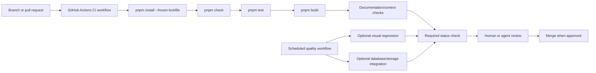

# Automated Testing and Continuous Integration Plan

This document proposes a concrete, incremental plan for keeping the portfolio safe as the public site, `/edit` workspace, draft persistence, canvas system, uploads, exports, and documentation continue to evolve. It is a **plan**, not an already-enabled CI service.

> **Current baseline:** Vitest already covers 10 test files / 71 tests, while `pnpm check`, `pnpm test`, and `pnpm build` are the current local release checks. No `.github/workflows/` configuration exists yet, so these checks are not automatically executed for every Git push or pull request.

## 1. Quality goals

| Goal | Why it matters for this project |
|---|---|
| Prevent broken public/editor parity | The editor must render the same portfolio design with additional scoped controls. |
| Protect immutable draft history | Save, restore, publish, and public-draft selection must not overwrite or lose history. |
| Protect media and export behavior | Images/PDFs must render after refresh and remain correctly packaged for offline ZIP export. |
| Catch type/build failures before release | The application combines client, server, shared types, database code, and export utilities. |
| Give future agents reliable evidence | A passing CI result is a reproducible signal, not an unverifiable claim. |

## 2. Recommended target architecture



GitHub Actions workflows are YAML files placed inside `.github/workflows/`; they can run automatically for pushes and pull requests.[1] The first implementation should use GitHub-hosted Linux runners, pin the Node version used by the project, enable pnpm caching, and run only deterministic checks.

## 3. Phase 1 — essential CI gate

The first CI pull request should create **one workflow only**: `.github/workflows/ci.yml`. It should run on pull requests and pushes to the default branch.

| CI step | Command / action | Purpose | Failure means |
|---|---|---|---|
| Checkout | `actions/checkout` | Gives the runner the repository files. | CI cannot access the commit. |
| Node + pnpm setup | Use the project’s pinned Node/pnpm versions. | Reproduces local dependency resolution. | Local and CI toolchains may differ. |
| Immutable install | `pnpm install --frozen-lockfile` | Rejects dependency drift. | `package.json` and lockfile are inconsistent. |
| Type check | `pnpm check` | Verifies TypeScript across shared/client/server code. | A contract or implementation is inconsistent. |
| Unit/component tests | `pnpm test` | Runs the current Vitest suite. | A covered behavior regressed. |
| Production build | `pnpm build` | Verifies client and server bundling. | Vercel/local production build will likely fail. |

The recommended minimum workflow shape is:

```yaml
name: Portfolio CI

on:
  pull_request:
  push:
    branches: [main]

permissions:
  contents: read

concurrency:
  group: portfolio-ci-${{ github.workflow }}-${{ github.ref }}
  cancel-in-progress: true

jobs:
  quality:
    runs-on: ubuntu-latest
    steps:
      - uses: actions/checkout@v6
      - uses: pnpm/action-setup@v4
        with:
          version: 10
      - uses: actions/setup-node@v5
        with:
          node-version: 22
          cache: pnpm
      - run: pnpm install --frozen-lockfile
      - run: pnpm check
      - run: pnpm test
      - run: pnpm build
```

This example is deliberately a **proposal**. Before adding it, verify the repository’s GitHub default branch, Node version policy, pnpm action versions, and whether the project has been exported to GitHub.

## 4. Phase 2 — improve test signals

After basic CI has been stable for several pull requests, add these improvements.

| Improvement | Proposed implementation | Benefit | Prerequisite |
|---|---|---|---|
| Coverage reporting | Add a Vitest coverage provider and `pnpm test:coverage` script. Upload the report as a CI artifact. | Shows whether new work is tested without forcing an unrealistic initial coverage target. | Choose coverage provider and baseline. |
| Focused test commands | Add scripts such as `test:client`, `test:server`, and `test:export` only if they reduce feedback time. | Lets agents run the smallest relevant suite during development. | Clear test-file grouping. |
| Formatter check | Add `format:check` using Prettier’s check mode. | Avoids formatting-only review noise. | Confirm current project formatting conventions. |
| Documentation/link check | Add a small script that confirms key docs and AI-context links/files exist. | Stops broken handoff links from silently accumulating. | Define allowed external-link behavior. |
| Test artifacts | Upload failure logs and coverage reports. | Makes an agent/human diagnosis faster. | CI artifact retention decision. |

Vitest is designed to run with Vite projects and supports a one-time `vitest run` mode for CI.[2] The existing `pnpm test` script already uses this style.

## 5. Phase 3 — integration confidence without touching production

Database and storage tests need more care than UI/unit tests. Never point CI at the user’s production draft database or live media store.

| Area | Recommended CI approach | What to avoid |
|---|---|---|
| Draft database | Use the in-memory PostgreSQL compatibility setup for unit/regression tests. Add a disposable PostgreSQL service container when migration/schema integration coverage is needed. | Running migrations against production or a shared manual database. |
| File storage | Use deterministic mocked storage helpers for ordinary unit tests. Add a dedicated non-production storage smoke test only after a test provider/store exists. | Reusing live certificate files or secrets in pull-request CI. |
| tRPC procedures | Exercise router/service behavior with controlled test context and test draft keys. | Depending on browser login or a mutable public draft. |
| Export | Test generated ZIP file names, structure, local PDF paths, and static rendering output. | Treating a download button screenshot as sufficient verification. |

## 6. Phase 4 — browser and visual regression testing

The current Vitest suite is valuable, but it does not fully prove visual layout. Add browser automation only after the basic CI gate is stable.

| Test layer | Proposed tool/approach | High-value scenarios |
|---|---|---|
| Browser interaction | Playwright against the local production-like build. | `/`, `/edit`, draft switching, save/publish confirmation, certificate viewer, ZIP export trigger. |
| Visual regression | Screenshot comparison with deliberate baseline approval. | Hero composition, public/editor parity for About, Experience disclosure, Selected Work image crop, mobile section layout. |
| Accessibility smoke test | Automated landmark/heading/focus checks plus selected manual keyboard review. | Navigation, dialogs, disclosure buttons, upload/control labels. |

Visual tests should be intentionally scoped. Screenshots are powerful for catching layout drift, but they can be noisy when fonts, rendering engines, or intentionally changed design baselines differ. Store approved baselines with a clear update review process.

## 7. Documentation and AI-context checks

The project already has a strong documentation and handoff system. CI should eventually protect that system as well.

| Check | Rule |
|---|---|
| Required files | Ensure key `docs/` and `ai-context/` records exist. |
| Cross-links | Verify relative Markdown links used in architecture/onboarding files resolve. |
| Current-work freshness | Require an explicit active/paused/completed status for the newest checkpoint-worthy task. |
| Task-to-context alignment | For code changes affecting architecture/data/design, require the relevant context file to be included in the change or an explicit “not applicable” explanation. |
| Secret scan | Reject obvious committed `.env` files or token-like values before review. |

Begin with non-blocking warnings for documentation freshness. Convert only well-understood checks into required CI gates; a bad automation rule is worse than a clear manual review reminder.

## 8. Branch protection and ownership

Once the repository is on GitHub and CI is stable, configure the default branch so the essential `Portfolio CI` workflow must pass before merging. Require at least one review for architecture, storage, database, or deployment changes. Keep Vercel deployment separate from CI until the user explicitly resumes deployment work.

| Change type | Required reviewer role | Required evidence |
|---|---|---|
| Public/editor UI | Design or frontend reviewer | Desktop/mobile proof, relevant tests, parity confirmation. |
| Shared content/data | Data/API reviewer | Contract impact, migration decision, persistence tests. |
| Assets/export | Storage/export reviewer | Refresh/export test and historical URL impact. |
| Documentation/AI context | Continuity reviewer | Updated active status, decisions/issues/change log as needed. |
| Deployment | Release reviewer + explicit user confirmation | Provider compatibility, environment plan, Preview smoke test. |

## 9. Implementation sequence

| Order | Deliverable | Acceptance criterion |
|---:|---|---|
| 1 | Export the project to a GitHub repository and confirm Actions is enabled. | Repository has an Actions tab and the intended default branch. |
| 2 | Add `.github/workflows/ci.yml`. | A pull request runs install, type check, tests, and build. |
| 3 | Add branch protection for the CI status. | A failing CI run blocks merge to the default branch. |
| 4 | Add `format:check` and optional documentation-link checks. | Formatting/docs regressions are visible in CI. |
| 5 | Add coverage reporting without enforcement. | Baseline is observable and uploaded as an artifact. |
| 6 | Add disposable database integration tests if a schema change needs them. | CI never uses production data. |
| 7 | Add Playwright visual/accessibility smoke tests. | High-value routes are tested with stable approved baselines. |

## 10. Definition of a healthy CI result

A green CI run means that the exact commit installed from the lockfile, passed TypeScript, passed the applicable Vitest tests, and built successfully. It does **not** mean that private credentials, production database behavior, visual quality, or deployment configuration has been fully verified unless those checks are explicitly added and reported.

## References

[1]: https://docs.github.com/en/actions/writing-workflows/quickstart "GitHub Actions workflow quickstart"
[2]: https://vitest.dev/guide/ "Vitest guide"
