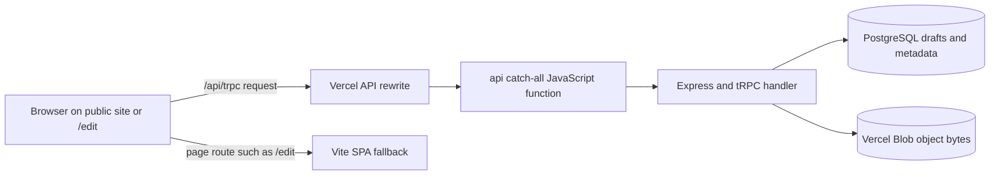

# Vercel API Bridge: Why `api/[...path].js` Exists

## Purpose

The file `api/[...path].js` is the **Vercel serverless function used by the portfolio backend**. It exists so the deployed React editor can make requests to the Express/tRPC application that manages drafts, PostgreSQL content, and Vercel Blob uploads.

> It is deployment infrastructure. It does **not** create a new portfolio page, alter the visual design, publish a draft, or by itself change a Vercel Production setting.

## The problem it solved

The public portfolio is a Vite single-page application. Vite’s client-side routing needs a fallback to `index.html` so URLs such as `/edit` load after a browser refresh. However, the editor also makes backend requests under `/api/trpc/*`. Before the bridge was packaged correctly, Vercel could treat an API request as a normal portfolio route, returning the SPA instead of a tRPC response. This prevented the editor from loading or saving its data.

An initial TypeScript serverless entry also encountered a module-format conflict. The shared Express dependencies use CommonJS-compatible loading, while the root application is configured as an ES module project. Vercel therefore needed a self-contained CommonJS API artifact instead of relying on dynamic imports of the source server at runtime.

| Earlier failure | User-visible effect | Corrected behavior |
|---|---|---|
| `/api/trpc/*` reached the SPA fallback. | `/edit` could show an unavailable or endlessly loading workspace because it received HTML instead of a tRPC result. | `/api/*` is routed before the SPA fallback. |
| The serverless function attempted to resolve shared server files with an incompatible module format. | Vercel could return a function error even though the public portfolio rendered. | A self-contained CommonJS function includes the server dependencies Vercel must run. |
| The API function did not have an explicit Vercel-recognized JavaScript entry. | Vercel could not reliably distinguish the API function from static application output. | `api/[...path].js` is the explicit catch-all serverless entry. |

## How the bridge works

The relevant files have different responsibilities:

| File | Responsibility | Editing rule |
|---|---|---|
| `server/vercel-api-handler.ts` | Source entry that creates the server application for Vercel packaging. | Edit only when backend behavior or API wiring changes. |
| `api/[...path].js` | Generated, bundled CommonJS serverless function Vercel executes for `/api/*`. | **Never hand edit.** Regenerate it from source. |
| `api/package.json` | Declares the generated `api/` directory as CommonJS even though the root project is ESM. | Keep this file with the generated function. |
| `vercel.json` | Sends `/api/*` to the function before the static SPA fallback. | Preserve route order unless deliberately changing deployment architecture. |
| `server/routers.ts` | Defines tRPC procedures such as draft load/save and asset upload. | Change with tests and regenerate the function afterward. |

The `[...path]` segment is a **catch-all route parameter**. It lets one Vercel function receive multiple backend URLs, including `/api/trpc/auth.me`, `/api/trpc/portfolio.editorContent`, `/api/trpc/portfolio.saveDraft`, and `/api/trpc/assets.upload`.

## What it enables

The bridge enables these deployed editor capabilities:

| Capability | Example route family | Why the bridge is required |
|---|---|---|
| Load the direct editor | `portfolio.editorContent` | The editor needs the current draft, version list, and public-draft status from PostgreSQL. |
| Save immutable draft versions | `portfolio.saveDraft` | The browser needs a server-side procedure to create a new version record safely. |
| Restore or choose drafts | `portfolio.restoreDraftVersion`, `portfolio.selectPublicDraft` | Draft history and public selection are server-managed data operations. |
| Upload new media | `assets.upload` | The server validates media, writes bytes to Blob, and stores metadata in PostgreSQL. |
| Read public portfolio data | `portfolio.publicContent` | The public app can fetch the selected public draft through the same backend boundary. |

## Safe maintenance workflow

When a change touches server API source, tRPC routers, database helpers, or Vercel API configuration, use this sequence on the `main` development branch before moving a validated candidate to `deployment_versel`:

1. Update the source files, tests, and any PostgreSQL migration required by the change.
2. Regenerate the deployed function with `pnpm build:vercel-api`.
3. Run `pnpm check`, `pnpm test`, and `pnpm build`.
4. Confirm `api/[...path].js` and `api/package.json` are included in the checkpoint.
5. Move the checkpointed candidate to `deployment_versel`, then verify a Vercel **Preview** response such as `GET /api/trpc/auth.me` and `/edit`.

> Do not delete the generated API file because it looks large. It is large because it bundles the server dependencies Vercel needs at runtime. Do not change it manually; its source-of-truth is the server code and the `build:vercel-api` script.

## Troubleshooting

| Symptom | Likely cause | Safe first check |
|---|---|---|
| `/edit` displays an API/query error. | `/api/*` may be falling through to the SPA, the function may have failed, or PostgreSQL may be unavailable. | Open `/api/trpc/auth.me`. A valid tRPC JSON response confirms the API route is active. |
| `/api/trpc/...` returns portfolio HTML. | The API rewrite no longer runs before the SPA fallback. | Review the `/api/(.*)` rewrite in `vercel.json`; do not change it blindly. |
| Vercel reports a module or `require` error. | The generated CommonJS artifact is stale, missing, or no longer scoped by `api/package.json`. | Run `pnpm build:vercel-api`, then include both API files in the release candidate. |
| Public `/` works but draft save/upload fails. | The static application succeeded while the serverless function, database variable, or Blob configuration failed. | Check Vercel logs and the Preview environment assignment without exposing any secret values. |
| Historical image or PDF does not render. | It may still reference legacy `/manus-storage` rather than a Blob URL. | Treat it as a media-migration task; the bridge cannot automatically copy old files into Blob. |

## Security boundary

The bridge makes backend functionality reachable; it does **not** add authentication. The current `/edit` route and write procedures are intentionally direct-access by user decision. This remains a deployment risk. Do not describe the API bridge as an access-control feature, and do not expose `DATABASE_URL`, `BLOB_READ_WRITE_TOKEN`, or any Vercel environment variable value in code, documentation, logs, or chat.

## References

[1]: https://vercel.com/docs/functions/runtimes/node-js "Vercel Node.js functions"
[2]: https://vercel.com/docs/projects/project-configuration "Vercel project configuration"
[3]: https://vercel.com/docs/deployments/environments "Vercel environments"
