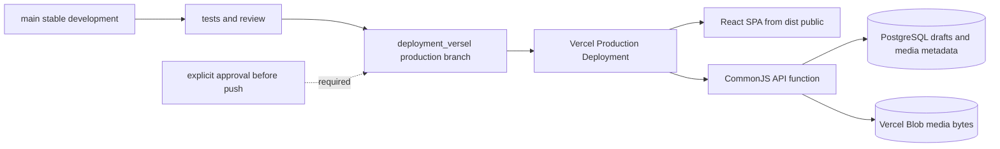

# Vercel Deployment Handbook

This folder is the operational reference for deploying and maintaining Fedi Nasri’s portfolio on Vercel. It covers the public portfolio, the direct `/edit` workspace, the tRPC API, PostgreSQL draft history, Vercel Blob media, and the generated static export. It does **not** grant permission to promote a deployment, change a domain, expose a secret, or alter Vercel settings; those actions still need the user’s explicit instruction.

> **Branch policy:** `main` is the stable development branch. `deployment_versel` is the Vercel-connected branch and, by explicit user-approved Vercel configuration on 2026-08-22, the **Production Branch**. Build, review, and validate a change on `main` first. Do not push it to `deployment_versel` until it is ready for Production, because a push to that branch now creates a Production Deployment.

## Start here

| Reader | Read next | Outcome |
|---|---|---|
| First-time Vercel user | [Beginner guide](./01-beginner-guide.md) | Understand Local, Preview, and Production without changing anything. |
| Developer or AI agent preparing a release | [Release runbook](./02-release-runbook.md) | Move an already-tested change from `main` to a verified Preview safely. |
| Person changing Vercel services | [Services and change guide](./03-services-and-change-guide.md) | Choose and change PostgreSQL, Blob, domains, and other Vercel services. |
| Person handling configuration | [Environment and access guide](./04-environment-and-access.md) | Manage variable names and scope without revealing values. |
| Person debugging the editor backend | [API bridge guide](./05-api-bridge.md) | Understand why the catch-all serverless function exists and how to maintain it safely. |

## Portfolio-specific Vercel map

| Concern | Current project fact | Source of truth |
|---|---|---|
| Vercel project | `portfolio` in FediNasri’s projects | [Project overview](https://vercel.com/fedi-s-projects2/portfolio) |
| Deployments | `deployment_versel` is the configured Vercel **Production Branch**; its new commits create Production Deployments | [Production environment settings](https://vercel.com/fedi-s-projects2/portfolio/settings/environments/production) |
| Current Vercel configuration | Static Vite output plus a Vercel-recognized API function | [`vercel.json`](../../vercel.json) |
| API function | Generated CommonJS artifact; rebuild after server/API source changes | [`api/[...path].js`](../../api/[...path].js), [`server/vercel-api-handler.ts`](../../server/vercel-api-handler.ts) |
| Draft database | Provider-neutral PostgreSQL; Neon is the currently connected host | [Storage](https://vercel.com/fedi-s-projects2/portfolio/stores), [`drizzle/schema.ts`](../../drizzle/schema.ts) |
| Media bytes | Public `portfolio-blob` Vercel Blob store for new editor uploads | [Storage](https://vercel.com/fedi-s-projects2/portfolio/stores) |
| Media metadata | PostgreSQL `portfolio_media_assets` table; no media bytes in SQL | [`drizzle/schema.ts`](../../drizzle/schema.ts), [`server/assets.ts`](../../server/assets.ts) |
| Environment variables | Vercel Project Settings; values must never be committed or copied to documentation | [Environment Variables](https://vercel.com/fedi-s-projects2/portfolio/settings/environment-variables) |
| Domains | Project assignment and DNS configuration | [Domains](https://vercel.com/fedi-s-projects2/portfolio/settings/domains) |

## What the deployment contains

The API route must be evaluated before the SPA fallback. `vercel.json` sends `/api/*` to `api/[...path].js`, serves files, preserves the legacy `/manus-storage/*` compatibility route, and finally maps client-side routes such as `/edit` to `index.html`.

## Non-negotiable safeguards

| Safeguard | Why it matters |
|---|---|
| Never commit `.env`, database URLs, Blob tokens, or Vercel tokens. | Vercel configuration must remain secret-backed and environment-scoped. |
| Rebuild `api/[...path].js` after any server/API change. | The deployed Vercel function is generated from server source and is not automatically regenerated by the Vite build. |
| Test draft behavior with a private disposable draft. | `Main portfolio` is the selected public draft and must remain intact unless the user explicitly requests a public change. |
| Store files in Blob and metadata in PostgreSQL. | File bytes in SQL increase database size and weaken media handling. |
| Treat `/edit` as security-sensitive. | It is intentionally unauthenticated; production access decisions require special care. |
| Treat historical `/manus-storage` URLs separately. | New Blob uploads work, but legacy media is not automatically migrated. |

## References

[1]: https://vercel.com/docs/deployments/environments "Vercel environments"
[2]: https://vercel.com/docs/environment-variables "Vercel environment variables"
[3]: https://vercel.com/docs/storage "Vercel Storage overview"
[4]: https://vercel.com/docs/vercel-blob "Vercel Blob documentation"
[5]: https://vercel.com/docs/domains/working-with-domains "Working with domains on Vercel"
