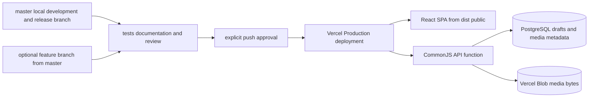

# Vercel Deployment Handbook

This folder is the operational reference for deploying and maintaining Fedi Nasri’s portfolio on Vercel. It covers the public portfolio, the direct `/edit` workspace, tRPC, PostgreSQL draft history, Vercel Blob media, and the generated static export. It does **not** grant permission to alter a live deployment, domain, secret, or environment setting; those actions still need explicit user instruction.

> **Current branch policy, approved 2026-08-24:** `master` is the canonical development branch and Vercel **Production Branch**. Its approved pushes create Production deployments. `deployment_versel` remains unchanged at historical release `e448599` as a rollback reference and is no longer the active deployment branch.

## Start here

| Reader | Read next | Outcome |
|---|---|---|
| First-time Vercel user | [Beginner guide](./01-beginner-guide.md) | Understand Local, Preview, and Production without changing anything. |
| Developer or AI agent preparing a release | [Release runbook](./02-release-runbook.md) | Validate and, after explicit approval, publish `master` safely. |
| Person changing Vercel services | [Services and change guide](./03-services-and-change-guide.md) | Safely manage PostgreSQL, Blob, domains, and Vercel services. |
| Person handling configuration | [Environment and access guide](./04-environment-and-access.md) | Manage variable names and scope without revealing values. |
| Person debugging the editor backend | [API bridge guide](./05-api-bridge.md) | Understand the catch-all serverless function and maintain it safely. |
| Person operating local-to-Production handoff | [Release and media operations](../release-and-media-operations.md) | Use the exact `master` release and media lifecycle guidance. |

## Portfolio-specific Vercel map

| Concern | Verified current fact | Source of truth |
|---|---|---|
| Vercel project | `portfolio` in FediNasri’s projects | [Project overview](https://vercel.com/fedi-s-projects2/portfolio) |
| Production Branch | `master`; every approved push creates a Production deployment | [Production environment settings](https://vercel.com/fedi-s-projects2/portfolio/settings/environments/production) |
| Latest verified Production | `master` commit `732c0ac`, Ready in 31 seconds | [Production deployment](https://vercel.com/fedi-s-projects2/portfolio/GuUXgkhsehPTuVKxDDm3ij8UycEU) |
| Historical rollback reference | `deployment_versel` commit `e448599`; preserved without modification | GitHub branch history and Vercel deployment history |
| Current Vercel configuration | Static Vite output plus Vercel-recognized API function | [`vercel.json`](../../vercel.json) |
| API function | Generated CommonJS artifact; rebuild after server/API source changes | [`api/[...path].js`](../../api/[...path].js), [`server/vercel-api-handler.ts`](../../server/vercel-api-handler.ts) |
| Draft database | Provider-neutral PostgreSQL; Neon is the current connected host | [Storage](https://vercel.com/fedi-s-projects2/portfolio/stores), [`drizzle/schema.ts`](../../drizzle/schema.ts) |
| Media bytes | Vercel Blob for new editor uploads | [Storage](https://vercel.com/fedi-s-projects2/portfolio/stores) |

## What the deployment contains

The API route must be evaluated before the SPA fallback. `vercel.json` sends `/api/*` to `api/[...path].js`, serves files, preserves the legacy `/manus-storage/*` compatibility route, and finally maps client-side routes such as `/edit` to `index.html`.

## Non-negotiable safeguards

| Safeguard | Why it matters |
|---|---|
| Do not push unreviewed work to `master`. | `master` is Production-backed, so a push is a live-release action. |
| Never commit `.env`, database URLs, Blob tokens, or Vercel tokens. | Secrets remain environment-scoped. |
| Rebuild `api/[...path].js` after server/API changes. | The deployed serverless function is generated separately from Vite. |
| Test persistence and uploads in a private disposable draft. | The public Main draft must remain intact unless explicitly changed. |
| Keep `deployment_versel` unchanged. | It is the retained historical release and rollback reference. |
| Treat `/edit` as security-sensitive. | It is intentionally unauthenticated. |

## References

[1]: https://vercel.com/docs/deployments/environments "Vercel environments"
[2]: https://vercel.com/docs/environment-variables "Vercel environment variables"
[3]: https://vercel.com/docs/vercel-blob "Vercel Blob documentation"
